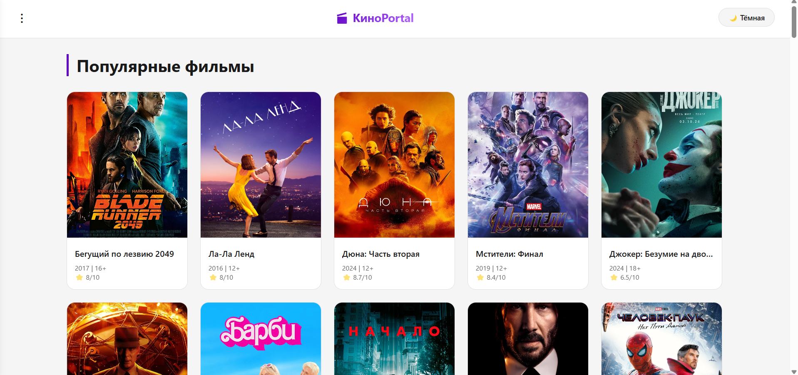

КиноPortal — это простенький по оформлению веб-сайт для поиска и просмотра информации о фильмах. Сайт позволяет пользователям просматривать популярные фильмы, ТОП-25 лучших фильмов, информацию об актёрах.

Функционал сайта:
Главная страница - отображение всех фильмов в виде карточек с постерами, годом и рейтингом
ТОП-25 - список 25 лучших фильмов с рейтингом
Актёры - список актёров с краткой информацией о них.
Модальное окно - при клике на карточку фильма или актёра открывается окно с деталями
Тёмная/светлая тема - позволяет переключать между темным и светлым режимом.

